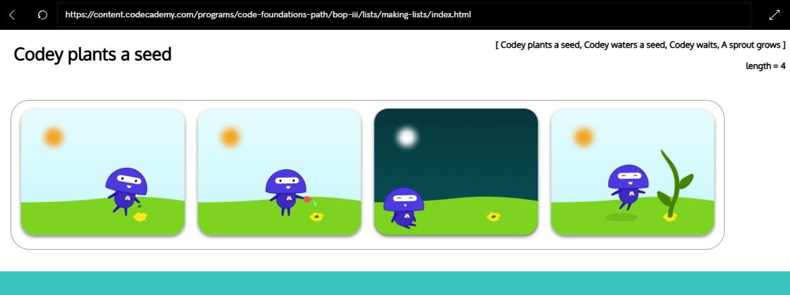

link to lesson:

https://www.codecademy.com/paths/code-foundations/tracks/learn-how-to-code/modules/bop-iii/lessons/bop-lists/exercises/bop-lists-introduction

### Lists

**Introduction to Lists**

When we start writing more complex programs, we’ll start working with more pieces of data. But data can get messy real fast if we’re not careful.

To keep our data tidy, we’ll want to use data structures. Data structures are formats that we can use to keep track of our data in an organized fashion.

Lists are one very basic data structure. Programmers use lists as a container to store multiple pieces of information that relate to each other in some way. Like a list of the presidents of the US, types of cheeses in alphabetical order, and the finishing positions of runners in a race.

What makes lists special is that they order our data in a specific, linear sequence.

Since our values are kept in order, it allows us to easily find the information we’re looking for; otherwise, we’d have a huge jumbled mess of data!

In this lesson, we’re going to cover:

- Accessing an item from a list
- Adding an item to a list
- Removing an item from a list

#### Instructions
Comic strips function in a similar way to lists. We can think of the strip as the list and each frame as a separate item in the list. The narrative that makes up a comic demonstrates that the items follow a specific order.

We create lists by adding items to an empty list. Right now we have a bunch of comic frames, but they’re not in any order and our comic strip is empty. Complete the comic strip by placing the frames in the correct order. Here’s how the story should go:

- Codey plants a seed
- Codey waters the seed
- Codey waits
- A sprout grows

